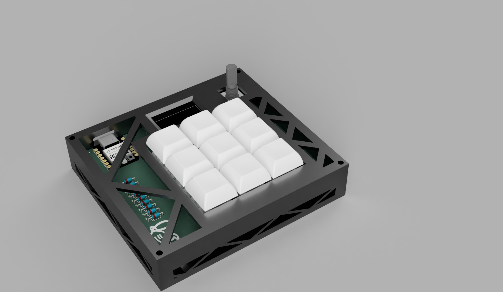
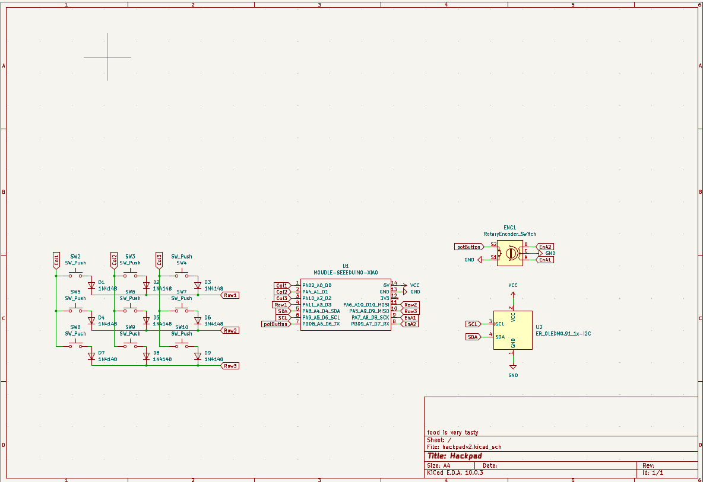
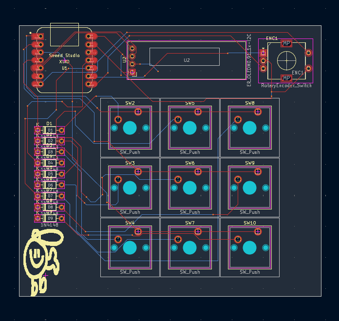
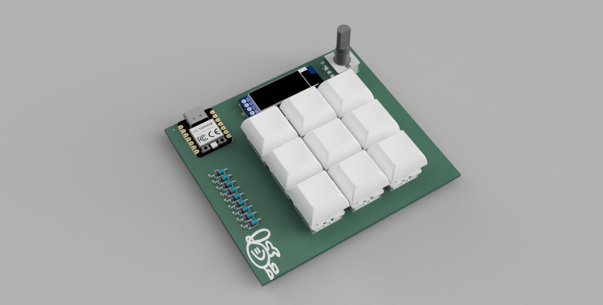

# gooberPad
A 9 key macropad that I made for Stardance Hackclub. This is my first time designing a PCB, making a large CAD, and using KMK.

## Features
 - 3x3 Key matrix. All assigned to useful functions
 - Volume knob
 - 0.91" OLED display
 - Silkscreen Timmy(he is cool)
 - KMK firmware
## Keymap
| =D | Column 1 |  Column 2 | Column 3 |
| --- | --- | --- | --- |
| Row 1 | Previous | Pause/Play | Next |
| Row 2 | ALT+TAB | Up arrow | Alt F4 |
| Row 3 | Left arrow | Down arrow | Right arrow |
## Gallery
Case Render

Schematic

PCB

## Firmware
This project uses KMK firmware. Check out [this document](firmware/INFO.md) to learn more.
## BOM
 - 1x Seeed Studio XIAO RP2040
 - 9x DSA Keycaps
 - 9x Cherry MX Switches
 - 4x M3x16 Screws
 - 4x M3 Heat inserts
 - 9x 1N4148 Diodes
 - 1x EC11 Rotary Encoder
 - 1x 128x32 0.91" OLED
 - 1x PCB
 - 1x 3D printed case